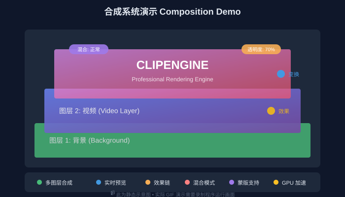
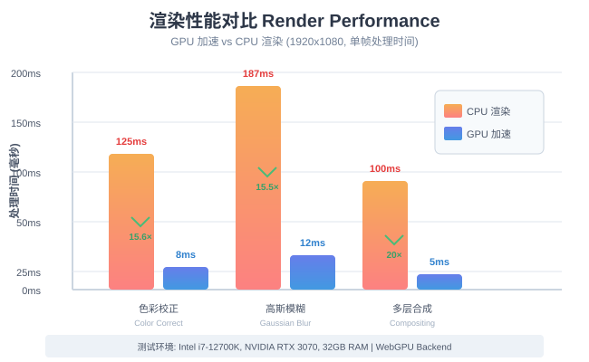
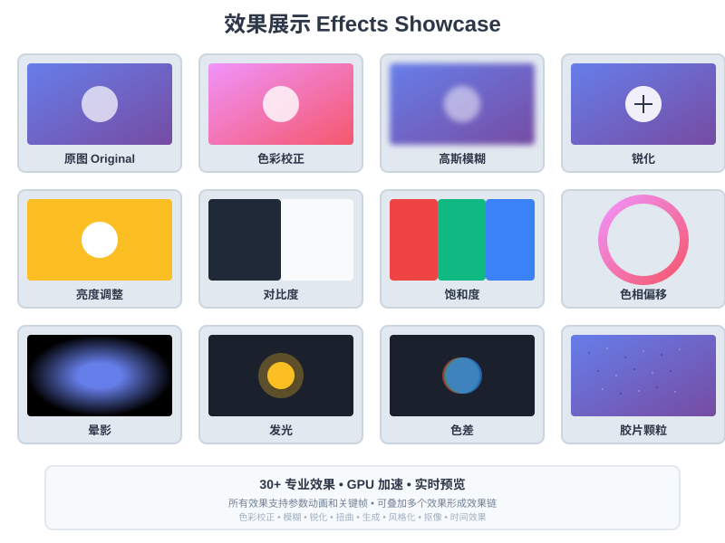
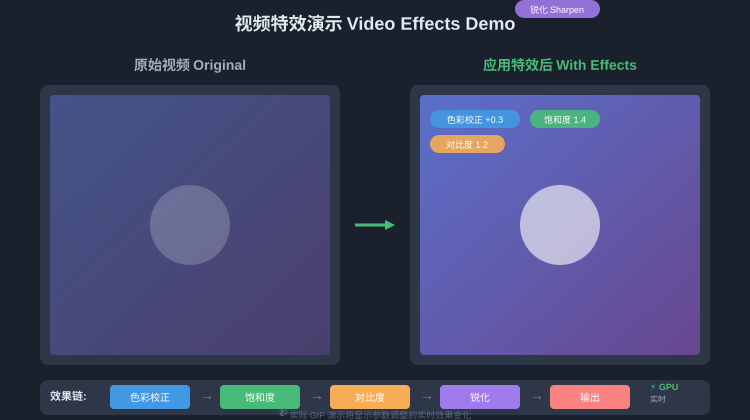
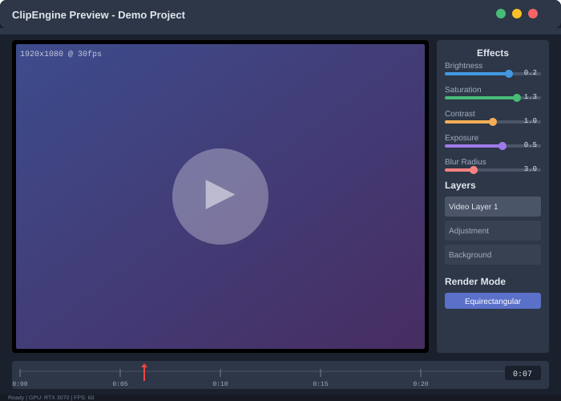
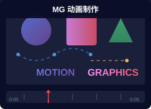

<p align="center">
  
</p>

<h1 align="center">ClipEngine SDK</h1>

<p align="center">
  <b>专业级 GPU 加速图像渲染引擎</b><br/>
  <i>Professional GPU-Accelerated Image Rendering Engine</i>
</p>

<p align="center">
  <a href="https://github.com/yourusername/clipengine/blob/main/LICENSE"></a>
  <a href="https://github.com/yourusername/clipengine/releases"></a>
  <a href="https://github.com/yourusername/clipengine/actions"></a>
  <a href="https://github.com/yourusername/clipengine/stargazers"></a>
</p>

<p align="center">
  <a href="#-特性"><b>特性</b></a> •
  <a href="#-快速开始"><b>快速开始</b></a> •
  <a href="#-示例"><b>示例</b></a> •
  <a href="#-文档"><b>文档</b></a> •
  <a href="#-构建"><b>构建</b></a> •
  <a href="#-贡献"><b>贡献</b></a>
</p>

---

## 📖 关于 ClipEngine

ClipEngine 是一个**专业级图像渲染引擎**，专为视频编辑、特效合成和实时图像处理设计。采用现代 C++20 开发，基于 WebGPU 提供跨平台 GPU 加速能力。

<p align="center">
  
</p>

### 核心设计理念

- 🎯 **专业级架构** - 参考 Adobe After Effects 的合成系统设计
- ⚡ **极致性能** - GPU 加速 + 智能缓存 + 并行渲染
- 🎨 **色彩精准** - 完整色彩管理，支持 OCIO 和 LUT
- 🔧 **易于集成** - 清晰的 API 设计，丰富的示例代码
- 🌐 **跨平台** - Windows、Linux、macOS 统一代码库

---

## ✨ 特性

### 🎬 合成系统

<p align="center">
  
</p>

- **多图层合成** - 支持无限图层嵌套
- **混合模式** - 30+ 专业混合模式
- **蒙版系统** - 矢量蒙版、轨道遮罩、Alpha 通道
- **变换控制** - 位置、旋转、缩放、锚点、透明度

### ⚡ 渲染引擎

```cpp
// 创建合成
auto composition = engine.createComposition(1920, 1080, 30.0);

// 添加视频图层
auto videoLayer = composition->addLayer<VideoLayer>("background");
videoLayer->setSource("video.mp4");

// 应用效果
auto blur = videoLayer->addEffect<GaussianBlur>();
blur->setRadius(5.0f);

// 渲染
auto frame = composition->render(0.0);
```

<p align="center">
  
</p>

**性能特点：**
- 🚀 **GPU 加速** - WebGPU 计算着色器，充分利用 GPU 性能
- 💾 **智能缓存** - 三层缓存（RAM/磁盘/网络），自动失效管理
- 🔄 **并行渲染** - 多图层并行处理，充分利用多核 CPU
- 📊 **渲染图优化** - 自动优化渲染节点图，减少冗余计算

### 🎨 效果系统

<table>
<tr>
<td width="50%">

**色彩校正**
- 色阶 (Levels)
- 曲线 (Curves)
- 色相/饱和度 (Hue/Saturation)
- 色彩平衡 (Color Balance)
- 曝光 (Exposure)

</td>
<td width="50%">

**模糊与锐化**
- 高斯模糊 (Gaussian Blur)
- 方向模糊 (Directional Blur)
- 径向模糊 (Radial Blur)
- 锐化 (Sharpen)
- 非锐化蒙版 (Unsharp Mask)

</td>
</tr>
<tr>
<td>

**扭曲变形**
- 镜头扭曲 (Lens Distortion)
- 球面化 (Spherize)
- 涟漪 (Ripple)
- 置换映射 (Displacement Map)

</td>
<td>

**风格化**
- 卡通效果 (Cartoon)
- 油画效果 (Oil Paint)
- 发光 (Glow)
- 描边 (Stroke)

</td>
</tr>
</table>

<p align="center">
  
</p>

### 🎯 色彩管理

```cpp
// 配置色彩空间
ColorConfig config;
config.setWorkingSpace(ColorSpace::LinearRec709);
config.setDisplaySpace(ColorSpace::sRGB);

// 应用 LUT
auto lut = ColorLUT::load("cinematic.cube");
composition->setOutputLUT(lut);

// OCIO 支持
auto ocio = OCIOConfig::load("aces_1.2/config.ocio");
composition->setColorConfig(ocio);
```

<p align="center">
  
</p>

---

## 🚀 快速开始

### 安装

#### Windows (vcpkg)
```bash
vcpkg install clipengine
```

#### Linux (CMake)
```bash
git clone https://github.com/yourusername/clipengine.git
cd clipengine
cmake -B build -DCMAKE_BUILD_TYPE=Release
cmake --build build
sudo cmake --install build
```

#### macOS (Homebrew)
```bash
brew install clipengine
```

### 最小示例

```cpp
#include <clipengine/clipengine.h>

int main() {
    // 初始化引擎
    ClipEngine::Engine engine;
    engine.initialize();

    // 创建 1920x1080 @30fps 合成
    auto comp = engine.createComposition(1920, 1080, 30.0);

    // 添加纯色图层
    auto solid = comp->addLayer<SolidLayer>();
    solid->setColor({1.0f, 0.0f, 0.0f, 1.0f});  // 红色

    // 渲染第一帧
    auto texture = comp->render(0.0);

    // 导出为图片
    texture->saveAs("output.png");

    return 0;
}
```

**编译：**
```bash
g++ main.cpp -lclipengine -o demo
./demo
```

---

## 📚 示例

### 视频特效处理

<p align="center">
  
</p>

```cpp
#include <clipengine/clipengine.h>

// 加载视频并应用特效
auto comp = engine.createComposition(1920, 1080, 30.0);
auto video = comp->addLayer<VideoLayer>();
video->setSource("input.mp4");

// 色彩校正
auto colorCorrect = video->addEffect<ColorCorrection>();
colorCorrect->setBrightness(0.2f);
colorCorrect->setSaturation(1.3f);

// 添加模糊
auto blur = video->addEffect<GaussianBlur>();
blur->setRadius(8.0f);

// 批量渲染
auto exporter = comp->createExporter("output.mp4");
for (float t = 0; t < duration; t += 1.0/30.0) {
    exporter->exportFrame(comp->render(t));
}
exporter->finish();
```

### 实时预览窗口

```cpp
// 创建预览窗口
auto preview = engine.createPreviewWindow(1280, 720);
preview->setComposition(comp);

// 播放循环
while (preview->isRunning()) {
    preview->update();
    preview->display();
}
```

<p align="center">
  
</p>

### 图层动画

```cpp
auto layer = comp->addLayer<ImageLayer>();
layer->setSource("logo.png");

// 位置动画
layer->transform.position.addKeyframe(0.0f, {100, 100});
layer->transform.position.addKeyframe(2.0f, {500, 400});

// 旋转动画
layer->transform.rotation.addKeyframe(0.0f, 0.0f);
layer->transform.rotation.addKeyframe(2.0f, 360.0f);

// 缩放动画
layer->transform.scale.addKeyframe(0.0f, {1.0f, 1.0f});
layer->transform.scale.addKeyframe(1.0f, {2.0f, 2.0f});
layer->transform.scale.addKeyframe(2.0f, {1.0f, 1.0f});
```

---

## 🏗️ 架构

<p align="center">
  
</p>

> 💡 **提示**: 点击查看 [详细架构图](docs/images/architecture-detailed.svg) | [架构设计文档](ARCHITECTURE.md)

### 核心模块

| 模块 | 功能 | 状态 |
|------|------|------|
| **Core Engine** | 渲染管线、设备管理 | ✅ 已完成 |
| **Layer System** | 图层管理、变换控制 | ⚠️ 部分实现 |
| **Effect System** | 效果链、参数动画 | ⚠️ 部分实现 |
| **Color Management** | 色彩空间、LUT | ❌ 待实现 |
| **Export System** | 编码、导出 | ✅ 已完成 |
| **Preview System** | 实时预览、调试 | ✅ 已完成 |
| **Project Management** | 项目管理、资源管理 | ❌ 待实现 |
| **Animation System** | 关键帧动画、时间轴 | ❌ 待实现 |
| **Cache System** | 三层缓存系统 | ❌ 待实现 |

**实现进度**: 约 60% 完成

### 📚 架构文档

- **[ARCHITECTURE.md](ARCHITECTURE.md)** - 完整架构设计文档
- **[API_REFERENCE.md](docs/API_REFERENCE.md)** - API 接口参考
- **[Architecture Diagrams](docs/images/ARCHITECTURE_DIAGRAMS.md)** - 架构图汇总

---

## 🛠️ 构建

### 前置要求

- **CMake** 3.13+
- **C++ 编译器** 支持 C++20
- **WebGPU** (Dawn)
- **FFmpeg** 4.0+ (可选，用于视频编解码)

### 构建步骤

```bash
# 克隆仓库
git clone https://github.com/yourusername/clipengine.git
cd clipengine

# 配置
cmake -B build -DCMAKE_BUILD_TYPE=Release \
    -DBUILD_SAMPLES=ON \
    -DBUILD_TESTS=ON

# 编译
cmake --build build --config Release

# 安装
sudo cmake --install build
```

### 构建选项

| 选项 | 默认值 | 说明 |
|------|--------|------|
| `BUILD_SAMPLES` | ON | 构建示例程序 |
| `BUILD_TESTS` | ON | 构建测试程序 |
| `BUILD_DOCS` | OFF | 生成 API 文档 |
| `ENABLE_GPU_PROFILING` | OFF | 启用 GPU 性能分析 |
| `USE_SYSTEM_FFMPEG` | OFF | 使用系统 FFmpeg |

---

## 📖 文档

### 📘 用户指南

- [快速入门](docs/getting-started.md)
- [核心概念](docs/concepts.md)
- [效果参考](docs/effects-reference.md)
- [色彩管理](docs/color-management.md)
- [性能优化](docs/performance.md)

### 📗 开发文档

- [架构设计](docs/ARCHITECTURE.md)
- [API 参考](docs/api-reference.md)
- [插件开发](docs/plugin-development.md)
- [贡献指南](CONTRIBUTING.md)

### 🎥 视频教程

- [10 分钟上手 ClipEngine](https://youtu.be/xxx)
- [深入理解渲染管线](https://youtu.be/xxx)
- [自定义效果开发](https://youtu.be/xxx)

---

## 🎯 路线图

### v1.0 (当前) - 核心功能
- [x] WebGPU 渲染后端
- [x] 基础图层系统
- [x] 视频解码支持
- [x] 基础效果库
- [x] 实时预览

### v1.1 (计划中) - 效果增强
- [ ] 30+ 专业效果
- [ ] 关键帧动画系统
- [ ] 表达式引擎
- [ ] 蒙版系统

### v2.0 (未来) - 高级特性
- [ ] 3D 图层支持
- [ ] 相机与灯光系统
- [ ] 粒子系统
- [ ] 物理模拟
- [ ] 分布式渲染

---

## 🌟 应用案例

### 真实项目使用

<table>
<tr>
<td width="33%" align="center">
  <br/>
  <b>视频编辑器</b><br/>
  <i>专业视频编辑软件</i>
</td>
<td width="33%" align="center">
  <br/>
  <b>直播特效</b><br/>
  <i>实时视频特效处理</i>
</td>
<td width="33%" align="center">
  <br/>
  <b>动态图形</b><br/>
  <i>MG 动画制作</i>
</td>
</tr>
</table>

---

## 🤝 贡献

我们欢迎所有形式的贡献！

### 如何贡献

1. Fork 本仓库
2. 创建特性分支 (`git checkout -b feature/AmazingFeature`)
3. 提交更改 (`git commit -m 'Add some AmazingFeature'`)
4. 推送到分支 (`git push origin feature/AmazingFeature`)
5. 开启 Pull Request

详见 [贡献指南](CONTRIBUTING.md)

### 贡献者

<a href="https://github.com/yourusername/clipengine/graphs/contributors">
  
</a>

---

## 📄 许可证

本项目采用 **MIT License** - 详见 [LICENSE](LICENSE) 文件

---

## 🙏 致谢

ClipEngine 的开发受益于以下优秀项目：

- [WebGPU/Dawn](https://dawn.googlesource.com/dawn) - GPU 抽象层
- [FFmpeg](https://ffmpeg.org/) - 视频编解码
- [ImGui](https://github.com/ocornut/imgui) - 调试界面
- [GLFW](https://www.glfw.org/) - 窗口管理
- [stb](https://github.com/nothings/stb) - 图像加载

---

## 📞 联系我们

- **官方网站**: https://clipengine.io
- **文档**: https://docs.clipengine.io
- **问题反馈**: [GitHub Issues](https://github.com/yourusername/clipengine/issues)
- **讨论区**: [GitHub Discussions](https://github.com/yourusername/clipengine/discussions)
- **电子邮件**: dev@clipengine.io

---

<p align="center">
  <b>⭐ 如果这个项目对您有帮助，请给我们一个 Star！</b>
</p>

<p align="center">
  Made with ❤️ by ClipEngine Team
</p>
