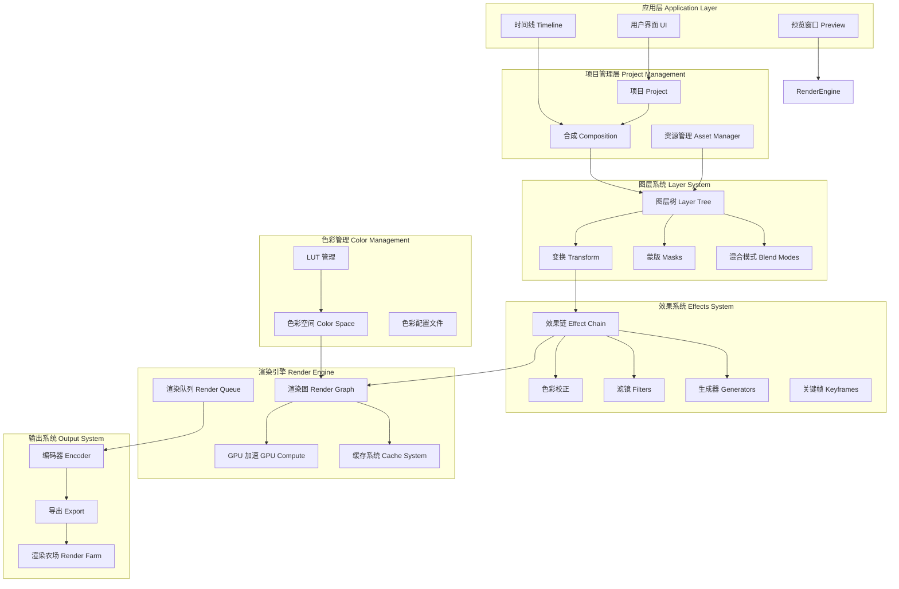
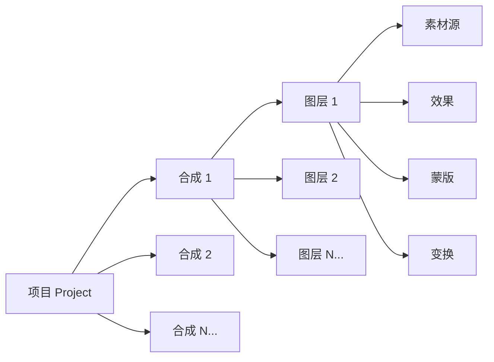
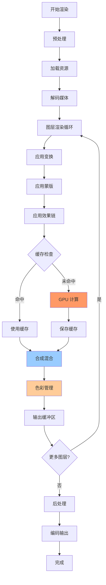
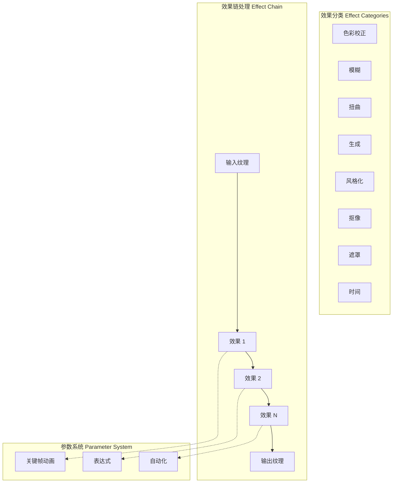
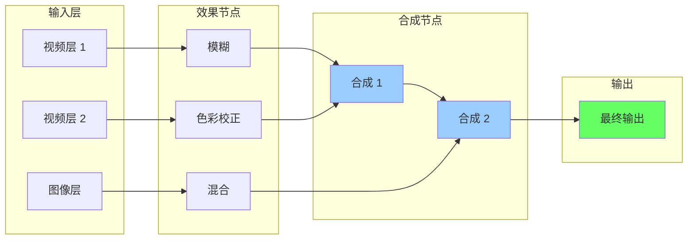
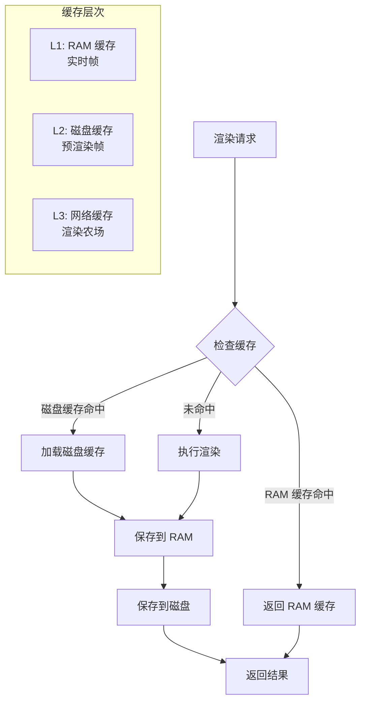
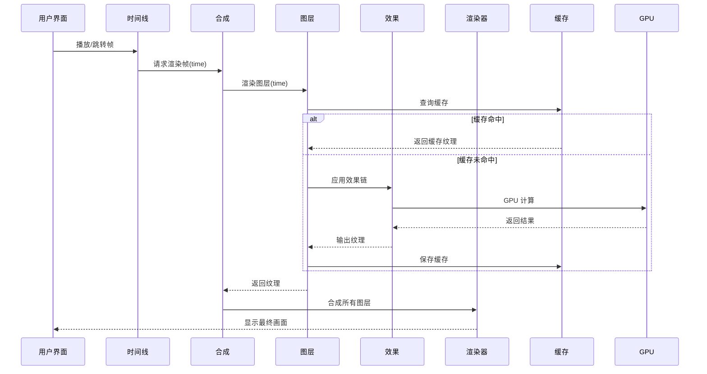
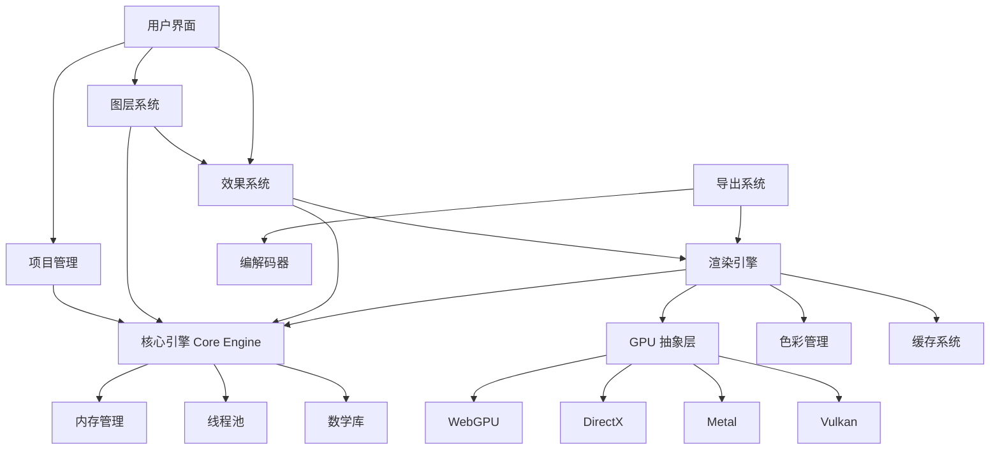

# 专业图像渲染引擎架构设计

> 参考 Adobe After Effects / Premiere Pro 的专业级架构

## 1. 整体架构图



## 2. 核心模块详解

### 2.1 项目层次结构 (Project Hierarchy)



**关键概念：**
- **Project (项目)**: 顶层容器，包含所有资源和合成
- **Composition (合成)**: 独立的渲染单元，类似 AE 的 Comp
- **Layer (图层)**: 基本渲染单元，支持嵌套合成
- **Asset (资源)**: 媒体文件、素材的引用

### 2.2 渲染管线 (Render Pipeline)



### 2.3 图层系统架构 (Layer System)

```cpp
// 图层基类设计
class Layer {
    // 基本属性
    LayerID id;
    string name;
    TimeRange timeRange;
    bool enabled;

    // 变换属性
    Transform2D transform;      // 位置、旋转、缩放
    float opacity;

    // 渲染属性
    BlendMode blendMode;
    vector<Mask*> masks;
    vector<Effect*> effects;

    // 父子关系
    Layer* parent;
    vector<Layer*> children;

    // 渲染方法
    virtual Texture render(RenderContext& ctx) = 0;
};

// 图层类型
class SolidLayer : public Layer {};          // 纯色图层
class ImageLayer : public Layer {};          // 图像图层
class VideoLayer : public Layer {};          // 视频图层
class ShapeLayer : public Layer {};          // 形状图层
class TextLayer : public Layer {};           // 文字图层
class AdjustmentLayer : public Layer {};     // 调整图层
class CompositionLayer : public Layer {};    // 嵌套合成
class CameraLayer : public Layer {};         // 相机图层
class LightLayer : public Layer {};          // 灯光图层
```

### 2.4 效果系统架构 (Effect System)



**核心效果接口：**

```cpp
class Effect {
public:
    // 基本信息
    string name;
    EffectCategory category;
    bool enabled;

    // 参数系统
    vector<Parameter*> parameters;

    // 渲染
    virtual Texture process(
        Texture input,
        RenderContext& ctx,
        float time
    ) = 0;

    // GPU 加速
    virtual bool supportsGPU() = 0;
    virtual Shader* getShader() = 0;
};

// 参数类型
class Parameter {
    string name;
    ParameterType type;  // Float, Color, Point, etc.

    // 动画
    bool animated;
    vector<Keyframe> keyframes;

    // 表达式
    string expression;

    // 获取值
    virtual Value getValue(float time) = 0;
};
```

### 2.5 渲染图优化 (Render Graph Optimization)



### 2.6 缓存系统 (Cache System)



**缓存策略：**

```cpp
class CacheSystem {
    // 多层缓存
    LRUCache<FrameID, Texture> ramCache;      // RAM 缓存
    DiskCache diskCache;                       // 磁盘缓存

    // 缓存键
    struct CacheKey {
        LayerID layerId;
        float time;
        Resolution resolution;
        uint64_t effectsHash;    // 效果链哈希
    };

    // 智能缓存
    void predictAndCache(TimeRange range);     // 预测性缓存
    void invalidate(LayerID layer);            // 失效处理
    void compact();                            // 缓存压缩
};
```

## 3. 数据流架构



## 4. 关键技术特性

### 4.1 实时预览优化
- **代理渲染**: 低分辨率实时预览
- **渐进式渲染**: 从粗糙到精细
- **区域渲染**: 只渲染可见区域
- **时间采样**: 跳帧预览

### 4.2 GPU 加速
- **计算着色器**: 通用 GPU 计算
- **多 Pass 渲染**: 复杂效果分解
- **纹理池**: 减少内存分配
- **异步传输**: CPU-GPU 并行

### 4.3 色彩管理
- **线性工作流**: 线性色彩空间计算
- **OCIO 支持**: OpenColorIO 集成
- **LUT 应用**: 3D LUT 色彩映射
- **HDR 支持**: 高动态范围渲染

### 4.4 分布式渲染
- **任务分割**: 帧级/层级任务分配
- **负载均衡**: 动态资源调度
- **断点续传**: 失败任务重试
- **结果合并**: 分片结果组装

## 5. 模块依赖关系



## 6. 性能优化策略

### 6.1 渲染优化
1. **懒计算**: 只渲染可见内容
2. **增量渲染**: 只更新变化部分
3. **并行渲染**: 多图层并行处理
4. **LOD 系统**: 根据缩放调整质量

### 6.2 内存优化
1. **纹理池**: 重用纹理内存
2. **流式加载**: 大文件分片加载
3. **智能卸载**: 自动释放未使用资源
4. **压缩缓存**: 缓存数据压缩存储

### 6.3 IO 优化
1. **异步加载**: 后台加载资源
2. **预读取**: 预测性资源加载
3. **缓冲策略**: 多缓冲区交替使用
4. **内存映射**: 大文件直接映射

## 7. 扩展性设计

### 7.1 插件系统
```cpp
class Plugin {
    virtual void initialize() = 0;
    virtual void shutdown() = 0;

    // 注册效果
    virtual vector<Effect*> getEffects() = 0;

    // 注册编解码器
    virtual vector<Codec*> getCodecs() = 0;

    // 注册 UI
    virtual Widget* getUI() = 0;
};
```

### 7.2 脚本支持
- **JavaScript/Python**: 自动化脚本
- **表达式引擎**: 参数驱动
- **插件 API**: 第三方扩展

## 8. 与 Adobe 概念对齐

| Adobe 概念 | 本架构对应 | 说明 |
|-----------|-----------|------|
| Composition | Composition | 合成，独立渲染单元 |
| Layer | Layer | 图层，支持多种类型 |
| Effect | Effect | 效果，支持 GPU 加速 |
| Property | Parameter | 属性，支持关键帧动画 |
| Expression | Expression | 表达式系统 |
| Pre-compose | CompositionLayer | 嵌套合成 |
| Adjustment Layer | AdjustmentLayer | 调整图层 |
| Blend Mode | BlendMode | 混合模式 |
| Track Matte | Matte | 轨道遮罩 |
| Time Remapping | TimeEffect | 时间重映射 |
| Color Management | ColorSpace | 色彩管理 |
| Render Queue | RenderQueue | 渲染队列 |

## 9. 实现路线图

### Phase 1: 核心引擎 (3个月)
- [x] 基础渲染管线
- [x] 图层系统
- [x] GPU 抽象层
- [ ] 缓存系统

### Phase 2: 效果系统 (2个月)
- [ ] 基础效果库
- [ ] 参数动画
- [ ] 表达式引擎
- [ ] GPU 加速

### Phase 3: 项目管理 (2个月)
- [ ] 项目文件格式
- [ ] 资源管理
- [ ] 预览系统
- [ ] 时间线

### Phase 4: 高级特性 (3个月)
- [ ] 色彩管理
- [ ] 3D 图层
- [ ] 粒子系统
- [ ] 物理模拟

### Phase 5: 生产工具 (2个月)
- [ ] 渲染农场
- [ ] 插件系统
- [ ] 脚本支持
- [ ] 导出优化

---

**文档版本**: v1.0
**最后更新**: 2025-11-03
**维护者**: ClipEngine Team
