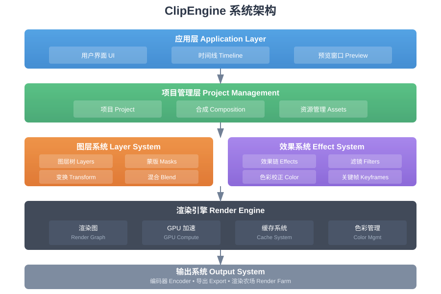
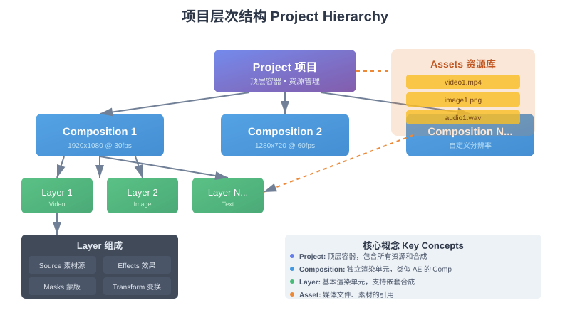
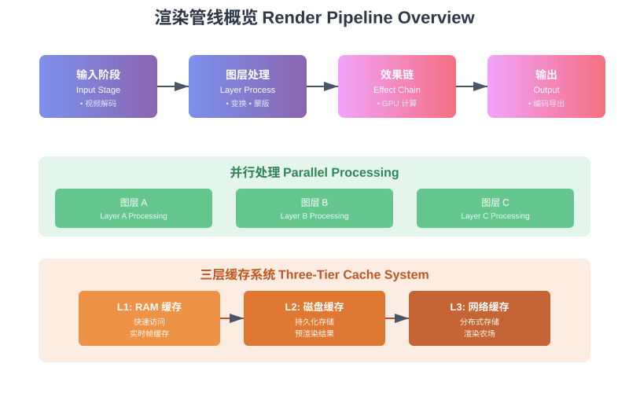
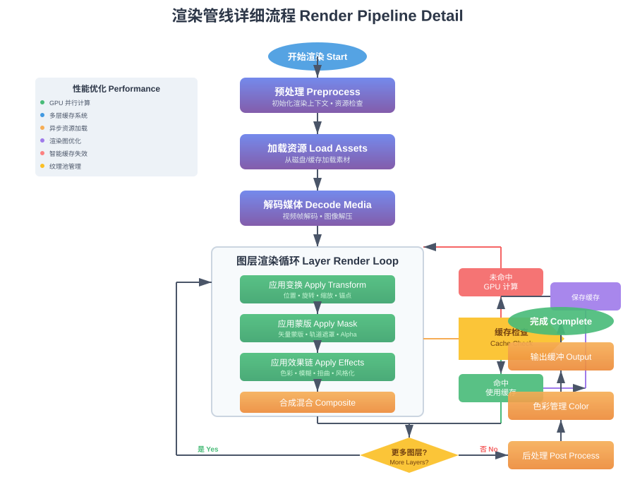
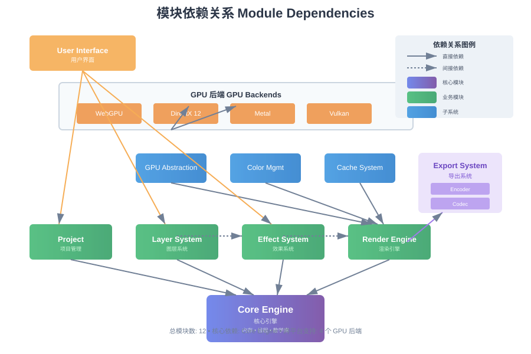
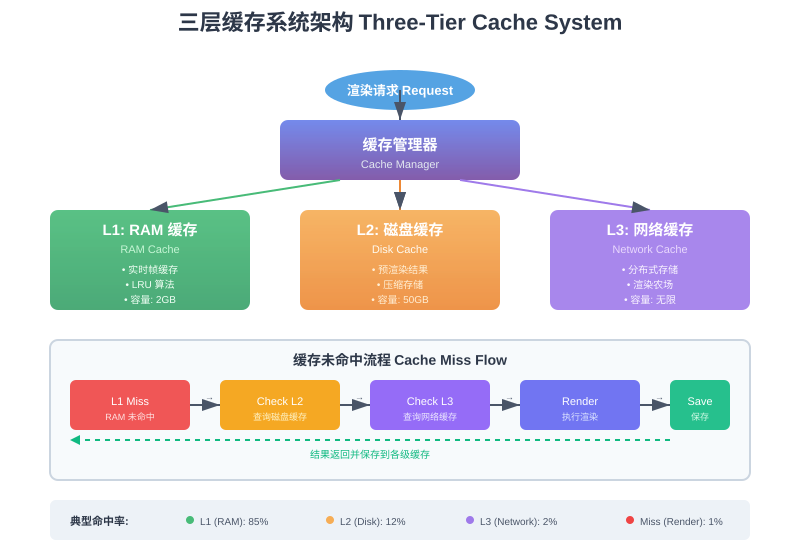
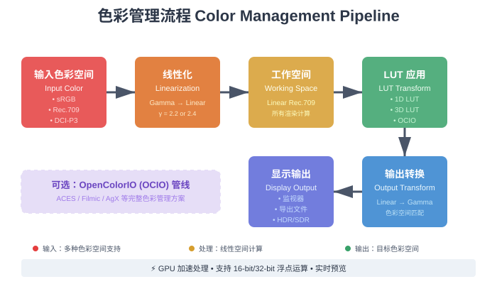

# ClipEngine 架构图汇总

本文档汇总了 ClipEngine SDK 的所有架构相关图表。

---

## 📊 架构图清单

### 1. 系统总览

#### `architecture.svg` (900x600, 8.3KB)
**用途**: 系统整体架构概览

**内容**:
- 5层架构设计（应用层 → 项目管理 → 图层/效果 → 渲染引擎 → 输出）
- 各层主要模块和功能
- 模块间数据流向

**适用场景**:
- 项目介绍
- 系统设计文档
- 技术演示PPT



---

### 2. 项目层次结构

#### `project-hierarchy.svg` (800x450, 8.8KB)
**用途**: 展示 Project → Composition → Layer 的层次关系

**内容**:
- Project（项目）作为顶层容器
- 多个 Composition（合成）组织
- Layer（图层）构成及组件（Source、Effects、Masks、Transform）
- Assets（资源库）关联关系
- 核心概念说明

**适用场景**:
- 概念说明
- 用户手册
- API 文档



---

### 3. 渲染管线

#### `pipeline-overview.svg` (800x500, 7.2KB)
**用途**: 渲染管线高层次概览

**内容**:
- 4阶段处理流程（输入 → 图层处理 → 效果链 → 输出）
- 并行处理示例（3个图层同时渲染）
- 三层缓存系统（RAM/磁盘/网络）
- 缓存流程说明

**适用场景**:
- 快速理解渲染流程
- 性能优化介绍
- 架构概述



#### `render-pipeline-detail.svg` (900x700, 13KB)
**用途**: 渲染管线详细流程图

**内容**:
- 完整的渲染流程（从开始到完成）
- 预处理 → 加载资源 → 解码媒体
- 图层渲染循环（变换 → 蒙版 → 效果 → 合成）
- 缓存检查分支（命中/未命中）
- GPU 计算路径
- 后处理和色彩管理
- 性能优化要点标注

**适用场景**:
- 深度技术文档
- 性能优化指南
- 开发者参考



---

### 4. 模块依赖

#### `module-dependencies.svg` (900x600, 11KB)
**用途**: 展示各模块间的依赖关系

**内容**:
- 核心引擎（Core Engine）作为基础
- 业务模块层（Project、Layer、Effect、Render）
- 子系统层（GPU Abstraction、Color Management、Cache）
- GPU 后端支持（WebGPU、DirectX 12、Metal、Vulkan）
- 导出系统和用户界面
- 直接依赖和间接依赖标注

**适用场景**:
- 模块设计文档
- 构建系统说明
- 代码组织参考



---

### 5. 缓存系统

#### `cache-system.svg` (800x550, 9.9KB)
**用途**: 三层缓存系统架构

**内容**:
- L1 缓存（RAM，2GB，实时帧）
- L2 缓存（磁盘，50GB，预渲染）
- L3 缓存（网络，无限，分布式）
- 缓存管理器
- 缓存未命中流程（5步处理）
- 典型命中率统计（L1: 85%, L2: 12%, L3: 2%, Miss: 1%）

**适用场景**:
- 性能优化文档
- 缓存策略说明
- 技术深度分析



---

### 6. 色彩管理

#### `color-management.svg` (700x400, 7.5KB)
**用途**: 色彩管理流程

**内容**:
- 6步色彩处理流程
- 输入色彩空间（sRGB、Rec.709、DCI-P3）
- 线性化（Gamma → Linear）
- 工作空间（Linear Rec.709）
- LUT 应用（1D/3D LUT、OCIO）
- 输出转换和显示
- 性能标注（GPU 加速、实时预览）

**适用场景**:
- 色彩管理文档
- 后期制作指南
- 专业用户参考



---

## 📐 图表使用指南

### 在 ARCHITECTURE.md 中引用

```markdown
## 系统架构


ClipEngine 采用分层架构设计...

## 渲染管线


详细的渲染流程包括...

## 模块依赖


各模块之间的依赖关系如图所示...
```

### 在演示文稿中使用

1. **打开 SVG 文件**（可在浏览器中查看）
2. **截图或导出为 PNG**
3. **插入到 PowerPoint/Keynote**

或直接使用 Inkscape 转换：
```bash
inkscape architecture.svg --export-type=png --export-width=1920
```

### 在文档生成工具中使用

如果使用 MkDocs、Sphinx 等工具：

```markdown
{ width="800" }
```

---

## 🎨 设计统一性

所有架构图采用统一的设计语言：

### 配色方案
- **紫色渐变** (#667eea → #764ba2): 核心模块
- **蓝色渐变** (#4299e1 → #3182ce): 业务模块
- **绿色渐变** (#48bb78 → #38a169): 图层/效果系统
- **橙色渐变** (#f6ad55 → #ed8936): 渲染/缓存
- **紫罗兰** (#9f7aea): 导出/子系统

### 元素样式
- **圆角矩形**: 6-8px，代表模块/组件
- **椭圆**: 流程的开始/结束
- **菱形**: 判断/决策点
- **箭头**: 实线表示直接依赖，虚线表示间接依赖

### 字体规范
- **标题**: Arial Bold, 14-22px
- **模块名**: Arial Bold, 12-16px
- **说明文字**: Arial Regular, 9-11px
- **中文**: Microsoft YaHei

---

## 📝 更新记录

| 日期 | 图表 | 变更 |
|------|------|------|
| 2025-11-03 | 全部 | 初始创建 |

---

## 🔄 维护指南

### 何时需要更新架构图

1. **添加新模块**时
   - 更新 `architecture.svg`
   - 更新 `module-dependencies.svg`

2. **修改渲染流程**时
   - 更新 `render-pipeline-detail.svg`
   - 检查 `pipeline-overview.svg` 是否需要同步

3. **调整缓存策略**时
   - 更新 `cache-system.svg`

4. **修改色彩管理**时
   - 更新 `color-management.svg`

### 如何修改 SVG

1. **直接编辑代码**
   - SVG 是文本格式，可用任何文本编辑器修改
   - 查找对应的 `<text>` 或 `<rect>` 标签

2. **使用图形工具**
   - [Inkscape](https://inkscape.org/) (免费)
   - Adobe Illustrator (专业)
   - [Figma](https://figma.com/) (在线)

3. **重新生成**
   - 如果改动较大，建议重新编写 SVG 代码

---

## 📚 相关文档

- [ARCHITECTURE.md](../ARCHITECTURE.md) - 完整架构设计文档
- [README.md](../README.md) - 项目主文档
- [images/README.md](README.md) - 所有图片资源说明

---

**创建日期**: 2025-11-03
**维护者**: ClipEngine Team
**版本**: 1.0
